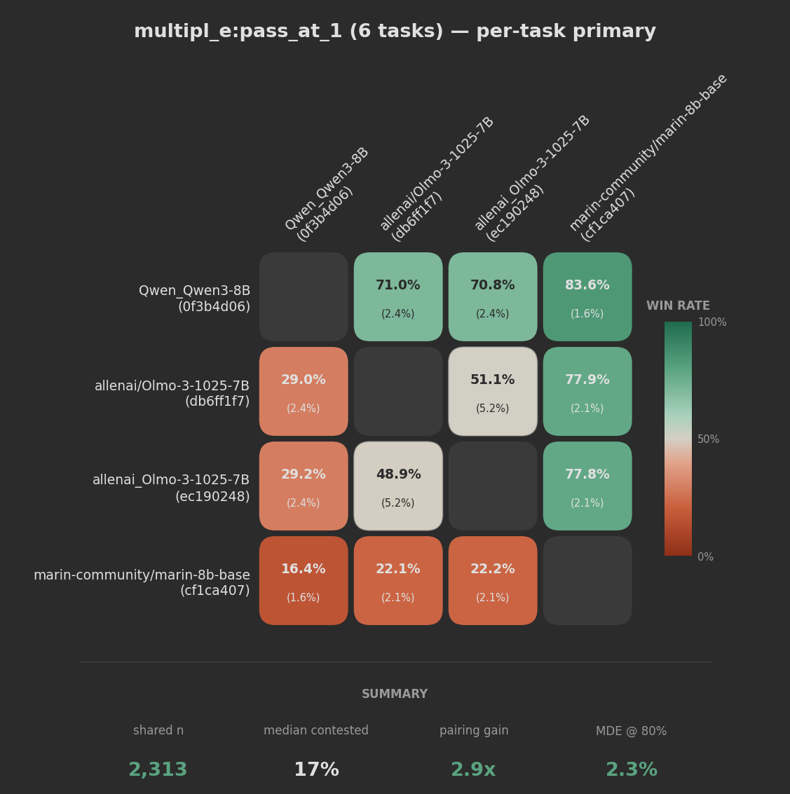
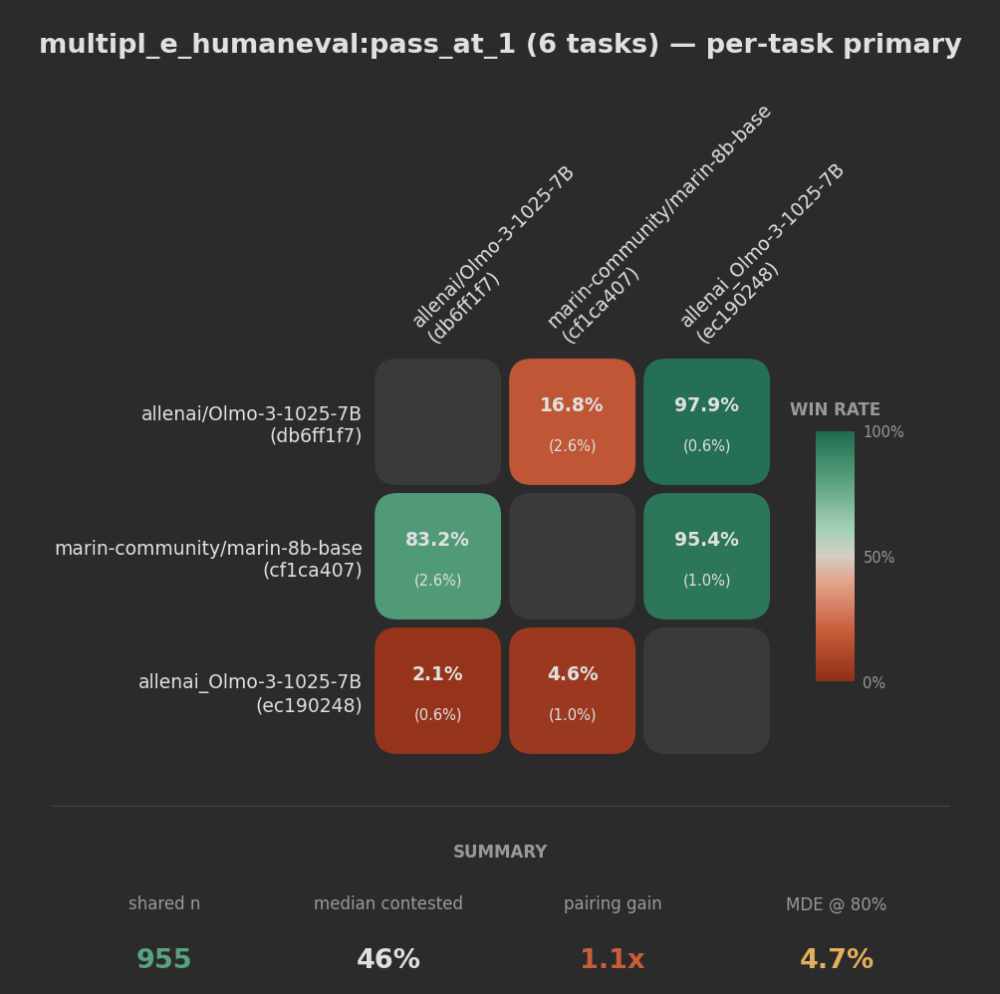

# Pairwise analysis — how to read the heatmap

Head-to-head win rates between N models on a shared task (or suite of tasks),
with per-cell standard errors (SE) and matrix-wide validity stats in the
footer. Every acronym here is defined in the [Glossary](#glossary) below.

The primary example below pools instances across a suite:

```
olmo-eval results pairwise \
  -G olmo-eval-sandboxfusion \
  -S multipl_e:pass_at_1
```

4 models, 6 MultiPL-E language tasks pooled, **2,313 shared instances** per
pair, binary pass/fail per question.



## Reading a cell — `win_rate (SE)`

Each non-diagonal cell shows model A vs model B on **contested** instances
(ties — questions where both models got the same score — are excluded from the
win rate):

```
  Qwen3-8B vs Marin-8B:              83.6% (1.6%)
  Qwen3-8B vs Olmo-3-7B (db6ff1f7):  71.0% (2.4%)
  Olmo-3-7B (db6ff1f7) vs Olmo-3-7B (ec190248):  51.1% (5.2%)
```

- `win_rate = wins_a / (wins_a + wins_b)` — fraction of contested questions A won.
- `SE = sqrt(p(1-p) / (n-1))` — standard error of that rate via the Central
  Limit Theorem (CLT), where `n` is the contested count.

**Rough 95% confidence interval (CI): `win_rate ± 2·SE`.**

- `83.6% (1.6%)` → roughly 80.4% – 86.8%. Far above 50% → Qwen3 beats Marin
  decisively across languages.
- `71.0% (2.4%)` → roughly 66.2% – 75.8%. Clearly above 50% → Qwen3 is a
  solid win over this Olmo-3 run.
- `51.1% (5.2%)` → roughly 40.7% – 61.5%. Crosses 50%, so we **cannot**
  distinguish these two runs from a tie — and that's correct: they're the
  *same model* ingested under two slightly different model names.

**Comparing two cells:** a difference between two win rates is meaningful if
it exceeds roughly `2·sqrt(SE1² + SE2²)`.

Lots of ties shrinks the contested `n` and inflates SE — so a cell with
`62.3% (8.1%)` on a high-tie pair is less precise than `58.0% (4.5%)` on a
low-tie pair, even though the headline number looks more decisive.

## Reading the footer

The footer shows matrix-wide validity stats. From the MultiPL-E example:

```
shared n    median contested    pairing gain    MDE @ 80%
 2,313           17%              2.9x            2.3%
```

Even though only **17%** of the shared questions are contested, the matrix still
lands in "read it head-on" territory because pairing is buying a lot of
precision and the matrix-wide MDE is small.

### `shared n`
Number of instances every model answered. Your raw sample size for every pair.
MultiPL-E pooled across 6 languages gives 2,313 questions per pair.

### `median contested`
Median fraction of shared questions that actually turn into head-to-head signal
after ties are removed:

- For each pair, `contested = wins_a + wins_b`.
- The footer reports the median `contested / shared n` across pairs.
- **17%** here means most shared questions are ties, so the per-cell SE is
  driven by a much smaller count than `shared n`.

### `pairing gain`
Median precision lift from the paired design:

- `pairing gain = median(n_eff / shared n)`.
- `n_eff = n × (σ_A² + σ_B²) / Var(d)` per pair; the footer compresses this to
  a single ratio.
- **2.9×** means the paired design is worth almost three times as many
  independent samples as an unpaired comparison would be.

### `MDE @ 80% power`
Minimum Detectable Effect (MDE) — the smallest true win-rate gap the matrix
can reliably resolve at significance level α=0.05 and 80% statistical power,
given its `shared n` and the **median** per-pair paired-difference variance
(used as a representative `ω²` so one outlier pair can't skew the summary).

- **2.3%** means: any pair with a true gap of at least 2.3 percentage points
  (pp) will come out statistically significant. Every non-diagonal cell in
  this matrix has `|win_rate − 50%| ≫ 2.3%`, so every comparison is
  trustworthy.
- Tiers: good ≤ 3pp, ok ≤ 10pp, bad > 10pp.

## Why pool up to the parent suite?

`multipl_e:pass_at_1` is a hierarchical suite — under the hood it aggregates
several sub-suites (HumanEval variants, MBPP variants, and translations of
each into other languages). You can scope the pairwise to any level of the
hierarchy. Here's the same models scoped to just the HumanEval-family
sub-suite:

```
olmo-eval results pairwise \
  -G olmo-eval-sandboxfusion \
  -S multipl_e_humaneval:pass_at_1
```



```
shared n    median contested    pairing gain    MDE @ 80%
   955           46%              1.1x            4.7%
```

The sub-suite is a strict subset of the parent's instances, so its stats
collapse compared to the top-level suite:

| Footer stat      | Sub-suite (HumanEval family) | Parent suite (MultiPL-E) |
| ---------------- | ---------------------------: | -----------------------: |
| shared n         |                          955 |                    2,313 |
| median contested |                          46% |                      17% |
| pairing gain     |                         1.1× |                     2.9× |
| MDE @ 80% power  |                    4.7% (🟡) |                2.3% (🟢) |

**Two things to notice:**

1. **MDE is yellow, not red.** The sub-suite can resolve ~5pp gaps, so the
   decisive cells in its matrix (16.8%, 83.2%, 95.4%, etc.) are still
   trustworthy. But a hypothetical 3pp gap between two similar models would
   vanish in the noise.
2. **The contested rate goes up but the pairing gain collapses.** The
   HumanEval-family slice has more head-to-head signal per shared question
   (**46%** contested vs **17%** in the parent suite), but the paired design is
   only worth **1.1×** extra precision instead of **2.9×**. Scoping up to the
   parent suite recovers that covariance structure across tasks, so the
   matrix-wide MDE drops sharply even though the contested fraction is lower.

**Takeaway.** The finer-grained the slice, the noisier the matrix. Prefer
the highest-level suite that still measures the capability you care about.
The parent suite is always at least as informative as any of its children
(same model comparisons, strictly more instances, usually better pairing gain
and lower MDE).

**How to explore the hierarchy:**

```
olmo-eval results suites -G <your-group>   # suites with DB coverage
olmo-eval results group <your-group>       # models + tasks + suites
```

**What NOT to pool.** Resist the urge to pool tasks that measure different
capabilities (e.g. math + dialogue). That inflates `shared n` without
improving signal — and can actually hurt pairing gain by driving `Var(d)` up.

## How cell SE and footer stats differ

- **Per-cell SE** is pair-specific and uses that pair's contested-only `n`.
  It tells you "how precise is *this* comparison?"
- **Footer MDE** is matrix-wide. It takes the **median** of per-pair
  paired-difference variances `Var(d)` as a representative `ω²` and plugs
  it into the MDE formula at the full `shared n`. "Median" rather than
  "pooled" so a single outlier pair (e.g. one with near-zero variance)
  can't distort the summary. It tells you "how precise is a typical
  comparison in this matrix?"
- **Median contested** tells you how much of the shared sample usually survives
  the tie filter. Low contested rates are a warning sign for wide cell SEs.
- **Pairing gain** tells you how much the paired design is helping overall. A
  matrix can have a healthy contested rate but still gain little from pairing
  if the models rise and fall together on the same questions.

## Rules of thumb

1. **MDE red** (> 10pp): only trust cells where `win_rate ± 2·SE` is far
   from 50%. Consider pooling to a suite before drawing conclusions.
2. **MDE yellow** (3–10pp): most small- to medium-sized gaps are suggestive
   but not conclusive; lean on the per-cell SE.
3. **MDE green** (≤ 3pp): you can read the matrix head-on; most cells are
   trustworthy.
4. **Low contested rate means wide cell SE.** If the footer says `median
   contested` is small, expect many cells to be tie-dominated even when
   `shared n` looks large.
5. **Pairing gain near 1× means pairing adds little.** In that regime, you are
   mostly living off raw sample size; pooling to a parent suite often helps.
6. **Ignore cell differences smaller than `2·sqrt(SE_a² + SE_b²)`** when
   comparing two non-diagonal cells in the matrix.

## Glossary

- **Win rate** — fraction of contested instances (ties excluded) on which
  model A outscored model B. `wins_a / (wins_a + wins_b)`.
- **Contested instance** — a shared question where the two models got
  *different* scores. Ties are excluded from the numerator and denominator
  of the win rate.
- **Tie** — a shared question where both models got the same score (within
  `--margin`, which defaults to 0). For binary 0/1 scoring ties are common
  since both models either solve it or neither does.
- **Shared instance** — an instance every model in the matrix has a score
  for. The pairwise comparison runs only on this intersection.
- **SE (standard error)** — the standard deviation of a statistic's sampling
  distribution. Shrinks as `1/√n`. Roughly, the true value is within `±2·SE`
  of the observed value ~95% of the time (CLT-based CI).
- **CLT (Central Limit Theorem)** — lets us treat the sample mean of enough
  independent observations as approximately normal, so we can use `SE` to
  form CIs and run z-tests without bootstrapping.
- **CI (confidence interval)** — `estimate ± 2·SE` is the approximate 95% CI.
  If the CI crosses 50%, we can't distinguish the pair from a tie.
- **α (significance level)** — false-positive rate. The pairwise tool uses
  α=0.05: a 5% chance of declaring a difference when none exists.
- **Power (1−β)** — probability of detecting a real gap of a given size. The
  tool uses 80%: when a true gap equals the MDE, we expect to find it ~80%
  of the time.
- **MDE (Minimum Detectable Effect)** — the smallest true win-rate gap that
  will come out significant at the given α and power. Matrix-wide MDE uses
  the *median* of per-pair paired-difference variances as a representative
  `ω²` (robust to outlier pairs), plugged in at the full `shared n`.
- **Median contested** — the median of `(wins_a + wins_b) / shared n` across
  pairs. Tells you how much of the shared sample usually survives after ties
  are removed.
- **Paired comparison** — both models answer the same shared questions, so
  per-question luck cancels in `d_i = score_a_i − score_b_i`. Shrinks the
  variance whenever models agree on what's easy vs hard.
- **Var(d) (paired-difference variance)** — sample variance of `d_i` across
  shared instances. Drives the paired MDE and `n_eff`.
- **σ² (marginal variance)** — per-model sample variance of scores across
  the same instances. `σ_A² + σ_B²` is what the unpaired MDE would use.
- **ω² (omega squared)** — between-question variance of the paired
  conditional means (Miller 2024 Eq. 8). In practice `Var(d) ≈ ω²` when
  each model produces one score per question.
- **n_eff (effective sample size)** — `n × (σ_A² + σ_B²) / Var(d)`. The
  number of independent samples the paired comparison is worth. Higher than
  `shared n` means pairing is buying precision; close to `shared n` means
  models disagree on which questions are hard.
- **Pairing gain** — `median(n_eff / shared n)` across pairs. A compact way to
  express how much precision the paired design is buying overall.
- **pp (percentage point)** — absolute difference between two percentages.
  A move from 52% to 55% is a 3pp gap, not a 3% gap.
- **z-test** — two-sample hypothesis test that uses the normal approximation
  from the CLT to decide whether an observed difference is larger than
  chance. The pairwise MDE is derived from the z-test formula.
- **Suite** — a registered group of related tasks (e.g. `multipl_e:pass_at_1`
  covers 6 language variants). Passing `-S <suite>` pools instances across
  its tasks so the MDE is computed on the larger combined sample.

## See also

- `eval_power.py` — Central Limit Theorem (CLT) helpers
  (`required_sample_size`, `minimum_detectable_effect`,
  `estimate_variance_components`).
- Miller, "Adding Error Bars to Evals" (arXiv:2411.00640) — methodology and
  worked examples.
